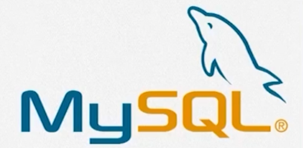
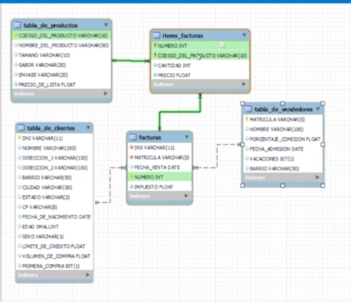

# 1. SQL
* SQL es un lenguaje de programacion que se emplea para trabajar con los datos de una base de datos
* Literalmente siginifica `Lenguaje Structurado de Consultas`.
## 1.2. Historia de SQL
* Este es un motor de base de datos que nos permite realizar tareas mas especializados con los datos persistidos en la `db`.
* Surge en los anios 70's
* Edgar Frank Tod
* Todo comenzo con los modelos relaciones, con los que se busco emplear un una seria de scrpts para trabajar con los datos relaciones.
* `ANSI -> SEQUEL(CRUD)`: El instituto de estandarizacion americana establece un estandar para trabajar con bases de datos relaciones empleando SQL.
    * Define tres grandes grupos de comandos para trabajar con las BD.
    * `DDL`: *data definicion language* -> crete, drop.
    * `DML`: *data manipulation language* -> select, update, delete
    * `DCL`: *data control language* -> administracion de usuarios, administracion de politicas de negocio y crecimiento de la base de datos.

ventajas: 

- Costo reducido de aprendizaje
- Portabilidad
- Longevidad
- Comunicacion
- Libertad de eleccion

desventajas
* todoo comienza con el nacimiento de redes sociales, que el modelo relacional ya no resuelve estos problemas de persistencia de datos.

- Falta de creatividad
- NoSQL
- Falta de estructuracion de sus lenguaje (cada lenguaje implemento sus propias sintaxis que los diferenciaba del resto de los lenguajes de programacion). 


## 1.3 Historia de MySQL




* En base al  `estandar` surge nuevos motores de bases de datos como lo es `myslq`.
* Fue creado por David Axmark, Allan Larsson, Michael Widenius.
* el `my` viene del nombre de la hija de `Michael`.
* Necesidades o problemas para crear el lenguaje `mysql`
    - Necesidad de una interfaz compatible
    - Desarrollaron su propia API de consulta de base de datos utilizando C++.
    - Sofware libre (Acceso a la comunidad)
 
* 2008 Sun microsystems  compro java y MySQL y sus usuarios entraron en consenso sobre  si el lenguaje aun se mantendria con la licencia de codigo abierto. Pero afortunadamente aun siguio con la versio `open source`.

### 1.3. 1 Caracteristicas de MySQL
* `Servidor Robusto`: Multiaccesso, data integrity, control de transacciones
* `Portabilidad`: Se puede ejecutan en cualquier sisitema operativo y se puede usan `con cualquiera de los lenguajes de progamacion popular`.

* `Multi-threads`: Facilita la integracion con el hardware + escalabilidad
* `Almacenamiento`: Prioriza la velocidad/ volumen
* `Velocidad`: + rapido ,e-comerce, AWS/BigQuery/Azurrre tienen instancias de MySQL.
* `Seguriadad`: Diversidad de menacinismo de segurirada
* `Capacidad`: hasta los 650000TB.
* `Aplicacbilidad`: Internet/desktop/corpotativo
* `Logs`: Registra todo. REcupera todo, replica de servidore. Si se cae un servidor en algun lugar del munod se puede recuperar facilmente los datos en este persistidos

### 1.3.2 Diagramas de entidad relacion
* Estos son los pilares del modelamiento (`modelo entidad relacion`) de bases de datos.
    * Modelo conceptual
    * Modelos fisico
    * Modelo logico

### 1.3.3. Comandos o scripts de consultas SQL
* `SELECT`: Este comando nos sirve para seleccionar un `tabla` o entidad de la db.
* `WHERE`: Esta es la clausula de condicional que nos  permite seleccionar registros de la db que cumplen  con una clausula o condicion establecida por where.

```sql
    -- selecciona todos los registros de la tabla customers.
    SELECT * FROM customers;
    
    -- seleccionar el nombre,apellido y id de la tabla customers.
    SELECT customers_id, first_name, last_name FROM customers;

    -- seleccionar los registros de la tabla customers con un alias
    SELECT customers_id AS id, first_name AS name from customers c;

    -- usando la clausula `where`
    SELECT first_name AS name, customer_id AS id from customers c WHERE id = 3;

    SELECT * FROM frutas WHERE sabor IN ('Mango', 'Uva', 'Pera');
    
```



